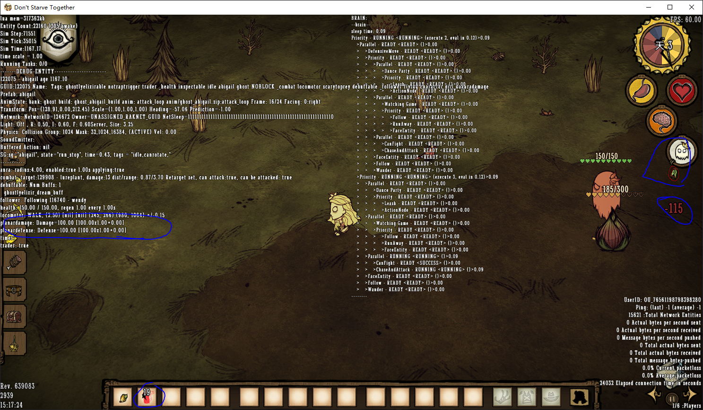

## 2024年12月9日

### 技能树背景图
素材中的大小是851x755像素。游戏中存在resize代码调整到600x460，但实际大小似乎并没有变化。
背景图必须提前注册：`self.bg_tree = self.root:AddChild(Image(GetSkilltreeBG(self.target.."_background.tex"), self.target.."_background.tex"))`

``` xml
<Atlas>
    <Texture filename="skilltree2.tex" />
    <Elements>
        <Element name="wormwood_background.tex" u1="0.416259765625" u2="0.831787109375"
            v1="0.631103515625" v2="0.999755859375" />
        <Element name="background.tex" u1="0.000244140625" u2="0.413330078125" v1="0.267822265625"
            v2="0.630615234375" />
        <Element name="wilson_background.tex" u1="0.000244140625" u2="0.415771484375"
            v1="0.631103515625" v2="0.999755859375" />
        <!-- u1v1 u2v2 分别对应图片的左下角与右上角坐标，数值是比率，原点在左下角 -->
    </Elements>
</Atlas>
```


### 技能树图标
素材中的大小是64x64像素。在游戏面板其宽高为30x30，该单位并非像素不会受窗口放大影响。
技能点按钮的坐标系原点在背景图中心点偏下的位置。
以威尔逊为参考：
- 一级火炬寿命的横坐标靠左在 x-214。
- 月光创新者的横坐标最靠右在 x228。
- 火炬两字靠上在 y206。
- 靠下的位置可以直接使用 y0，刚好位于说明框的上方一点点。
- 背景图片的中心点约在 x0y75 的位置
- 位于原点图标向上移动75点，可使按钮底部可差不多对齐背景图片的中心横轴
- 位于原点图标向下移动155点，可使按钮底部可差不多对齐背景图片的底部

前面提到的resize 600x460，其高度刚好等于(155+75)*2，所以可以判定设置的位置采用是这个宽高，所以在ps上：
1. 以 851x755 画布绘制背景图。
2. 缩小到 600x460 像素，用于摆放按钮。
2. 使用矩形模拟按钮，按钮的大小调整到 30 像素，将按钮的中点设置在中下侧。
3. 在x300、y230、y305的位置分别放上一条参考线，其中交叉点靠上的是画布中心靠下的是面板的中心。
4. 将按钮摆好后，选择按钮的中心到中下，并记录xy坐标。
5. 将记录的坐标x-300,305-y


## 2024年12月10日

### 技能树数据结构解析
``` lua
local ORDERS =
{
    { "torch",      { -214 + 18, 176 + 30 } },
    { "alchemy",    { -62, 176 + 30 } },
    { "beard",      { 66 + 18, 176 + 30 } },
    { "allegiance", { 204, 176 + 30 } },
}
```
这是技能树每条路线/每个体系的数据。

第一个字段是这个体系的标识符。
第二个字段是这个体系的标题位置。

技能树体系不会对技能树按钮的摆放产生任何影响。
技能树体系的实际显示效果只有那个标题，下面的方框是背景图的效果。
体系标题的字符串必须注册在指定位置：`panel.title   = self:AddChild(Text(HEADERFONT, 18, STRINGS.SKILLTREE.PANELS[string.upper(panel.name)],
        UICOLOURS.GOLD))`。

***如果某个体系没有被按钮引用会引发异常，报错信息：[string "scripts/widgets/redux/skilltreebuilder.lua"]:---: attempt to index local 'panel' (a nil value)***


``` lua
local skills =
{
    wilson_alchemy_1 = {
        title = STRINGS.SKILLTREE.WILSON.WILSON_ALCHEMY_1_TITLE,
        desc = STRINGS.SKILLTREE.WILSON.WILSON_ALCHEMY_1_DESC,
        icon = "wilson_alchemy_1",
        pos = { -62, 176 },
        --pos = {1,0},
        group = "alchemy",
        tags = { "alchemy" },
        root = true,
        connects = {
            "wilson_alchemy_2",
            "wilson_alchemy_3",
            "wilson_alchemy_4",
        },
    },
    wilson_allegiance_lock_1 = {
        desc = STRINGS.SKILLTREE.WILSON.WILSON_ALLEGIANCE_LOCK_1_DESC,
        pos = { 204 + 2, 176 },
        --pos = {0.5,0},
        group = "allegiance",
        tags = { "allegiance", "lock" },
        root = true,
        lock_open = function(prefabname, activatedskills, readonly)
            return SkillTreeFns.CountSkills(prefabname, activatedskills) >= 12
        end,
        connects = {
            "wilson_allegiance_shadow",
        },
    },
}
```
这是技能树每个技能/每个按钮的数据。

每个按钮的键是它的标识符。
如果是第一个按钮需要设置 `root` 字段。
锁按钮需要设置一个判断方法。
在字段 `connects` 设置下一个按钮的标识符。
在字段 `group` 设置体系标识符。
在字段 `tags` 设置体系标识符，如果是特殊按钮需要额外标签，比如锁按钮需要`"lock"`。


### 代码笔记
#### 资源
使用 `Asset(type, path)` 包装资源路径。类型支持`"ATLAS"`、`ANIM`。在modmain.lua文件声明`Assets`引入资源。


### 组件与预制件

工厂(预制件 `Prefab`) 对象(实体 `Entity`) 装饰器(组件 `Component`)。
部分组件虽然暴露给lua使用但其在底层用c代码实现，所以无法查看源码。
用了 `local` 函数少折腾，浪费时间，老老实实自己写吧。

在modmain.lua文件声明`PrefabFiles`引入预制件路径。


``` lua
-- 比较常用的初始化方式
local name = "ghostlyelixir_dream"

local assets = {
    Asset("ANIM", "anim/ghostlyelixir_dream.zip"),
    Asset("IMAGE", "images/ghostlyelixir_dream.tex"),
    Asset("ATLAS", "images/ghostlyelixir_dream.xml")
}

local function fn()
    local inst = CreateEntity()

    inst.entity:AddTransform()
    inst.entity:AddAnimState()

    MakeInventoryPhysics(inst)

    inst.AnimState:SetBuild(name)
    inst.AnimState:SetBank(name)
    inst.AnimState:PlayAnimation("default", true)

    MakeInventoryFloatable(inst)


    inst:AddComponent("inspectable")
    inst:AddComponent("inventoryitem")
    inst:AddComponent("stackable")
    inst.components.inventoryitem.atlasname = "images/ghostlyelixir_dream.xml"

    inst:AddComponent("ghostlyelixir")

    if not TheWorld.ismastersim then
        return inst
    end
    return inst
end

return Prefab(name, fn, assets, prefabs)
```


## 2024年12月11日

### 美梦药剂
修改血量图标右下角的那个小图标的关键是：`widgets\pethealthbadge.lua:PetHealthBadge:ShowBuff(symbol)`。
好不容易找到了位置又被作者的一句话折腾了半天，最终还是用笨方法，靠！

美梦药剂是原封不动复制与原有药剂的代码，并修改了部分参数。
美梦药剂的特效功能是用的的万精油的。

暂未添加制作配方。




### AI
游戏中行为逻辑的实现依靠两种模型，他们的专业名词叫有限状态机模式(FSM)与行为树模式 (BT)。


在游戏里，行为树文件后缀`brain`，状态机文件前缀`SG`。
我个人的感受是游戏中行为树被用于比较简单明了的逻辑判断，状态机则是负责比较精细灵活的逻辑判断。
行为树的逻辑判断更加内敛完整，与外部交互较少。
状态机的逻辑判断更加松散，依赖外部信号。

#### 状态机
状态机是个图。状态就是图中的节点，节点中的一条路径就是一次状态切换。

#### 行为树
行为树顾名思义是个树，行为树是没有状态这个概念的，有的是节点，遍历时根据节点选则合适方向。

## 2024年12月12日

### 阿比盖尔状态机解析


所以阿比盖尔攻击与否的关键是拦截 `("stategraphs/SGabigail").states["appear"].onexit` 函数中的 `inst.components.aura:Enable(false)`。

### 阿比盖尔的攻击附加给温蒂
描述比较少，先简单理解为阿比发射了一个魔法球。因为打中怪物的是魔法球并不是我阿比盖尔，所以这次攻击与我阿比盖尔无关。


## 2024年12月13日

### 警告！不要碰 AddOverrideBuild()
不要碰 `inst.AnimState:AddOverrideBuild()` ，它会让你不幸，除非是对官方现有的动画进行兼容，函数 `inst.AnimState:OverrideSymbol()` 能完全替代前者的作用，真的！

### 替换实体部件贴图
需要注意的是，动画中的Symbol是指的动画中的一个部位，要求同一部位的贴图必须放在同一个文件夹下，这个文件夹就是Symbol的名称。

### 禁止阿比盖尔追逐攻击目标
删除阿比盖尔行为树中的`ChaseAndAttack`节点即可。

### 添加美梦药剂的配方
制作配方官方提供的函数能直接让其与技能树关联。至于如果有观察技能树的需求的话监听`"onactivateskill_server"`与`"ondeactivateskill_server"`即可，他们来自`inst.components.skilltreeupdater`。


## 2024年12月14日

### 添加阿比盖尔行为
阿比盖尔可以用无形的大手抓蝴蝶了，强行塞给你。

### 一次该死的找bug时间
在给温蒂添加范围伤害的时候发生了一件事：
``` lua
function fn()
    TheInput:AddKeyHandler(function(key, down)
        if key == KEY_INSERT then
            inst.components.aura:Enable(down)
            if down then
                inst.components.playervision:PushForcedNightVision(inst, 1, ANCIENTFRUIT_NIGHTVISION_COLOURCUBES,
                    true)
            else
                inst.components.playervision:PopForcedNightVision(inst)
            end
        end
    end)
    return inst
end
```

在温蒂实体初始化函数添加了一个按键事件，让这个按键事件启用关闭这个功能。但是神奇的事情发生了，每当我新建一个档时这个功能能正常使用，但当我重载一下游戏，诶报错了？？？
是怎么回事呢，是因为`aura`这个组件在`OnTick`回调中把一个**无效的自己**传给了`combat:DoAreaAttack`的范围攻击函数，导致范围攻击函数获得无效的坐标信息导致恐慌。
我将这段代码复制到源文件中，以确保不是mod的问题，事实证明也确实不是。我注意到错误信息上的实体名前面的数字和debug面板上的数字不一样。
这数字我估计是每个实体的序列号，如果是的话，那不就说明其实有两个我？？？
我将初始函数，按键范围攻击的回调函数打印了一下各自的`inst`，一看
```
[00:00:31]: Restoring user: session/36257117BC98FB97/C7GSC53084I83I906940H00/0000000004	
[00:00:31]: MYWD_FN: 	114947 - 	 | 	true	
[00:00:31]: MYWD_FIND_OK:	114947 - 	
[00:00:31]: MYWD!!	114947	  	114947 - 	
[00:00:31]: MYWD!!	t1	  	123	
[00:00:31]: Serializing user: session/36257117BC98FB97/C7GSC53084I83I906940H00/0000000005
[00:00:31]: 1 uploads added to server. From server_temp
[00:00:31]: Telling Client our new session identifier: 36257117BC98FB97
[00:00:31]: Check for write access: TRUE
[00:00:31]: Check for read access: TRUE
[00:00:31]: Available disk space for save files: 111381 MB
[00:00:31]: ModIndex: Load sequence finished successfully.	
[00:00:31]: Reset() returning
[00:00:38]: Attempting to send resume request
[00:00:38]: Resuming user: session/36257117BC98FB97/C7GSC53084I83I906940H00/0000000005
[00:00:38]: MYWD_FN: 	115097 - 	 | 	true	
[00:00:38]: MYWD_FIND_OK:	115097 - 	
[00:00:38]: MYWD!!	115097	  	115097 - 	
[00:00:38]: MYWD!!	114947	  	114947 - wendy	
[00:00:38]: MYWD!!	t1	  	123	
```
真的有两个我，每次加载的时候会新生成一个实体，这个新实体才是正在操控的角色，而旧实体会被标记为无效并等待回收（已验证）。

但是，由于旧实体被我的按键回调函数给引用了，这下旧实体即便已被视为无效但依然不会被回收，直到我按下按键这个已经无效的实体强行执行不该执行的代码。

#### 解决办法
这个功能最正确的做法应该是在全局环境创建一个按键回调，并用 `ThePLayer` 获得当前正则操控的角色实体。

此外，在原有的代码加上检查实体对象的校验虽然同样可行，但这会导致旧实体迟迟不被释放，导致内存泄露。